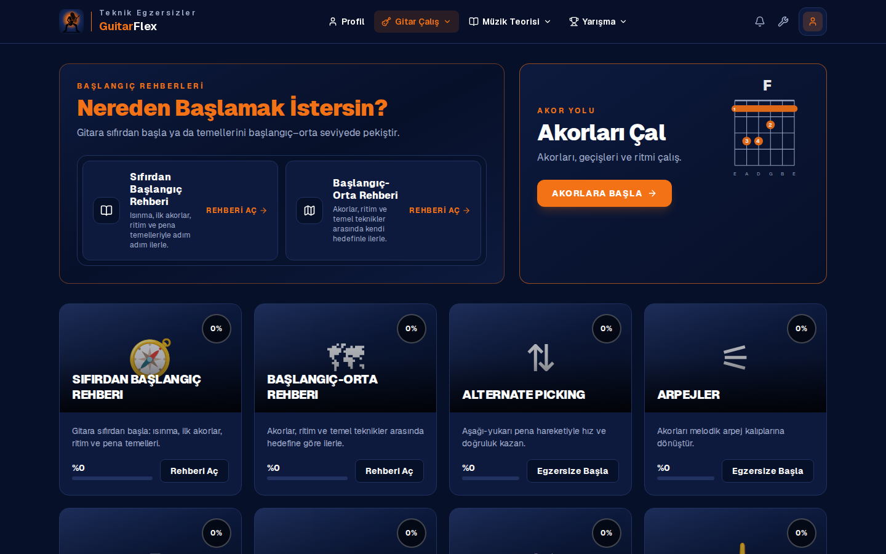
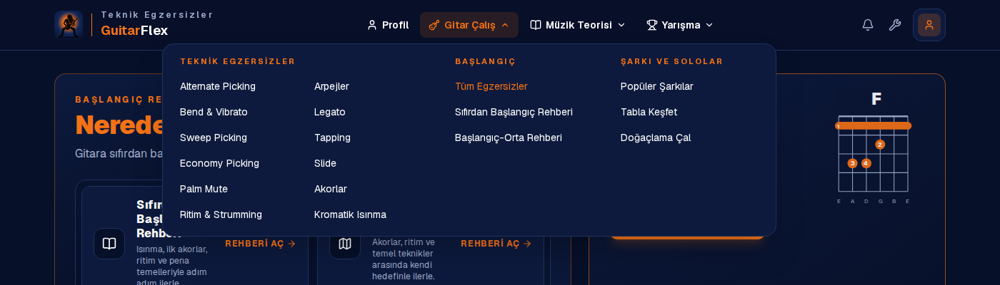
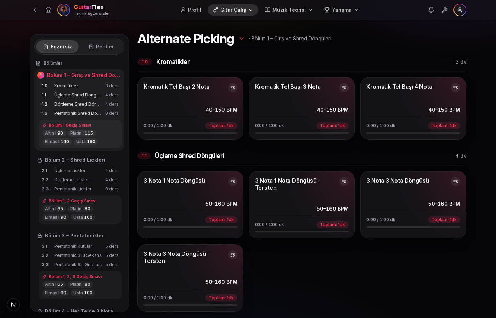
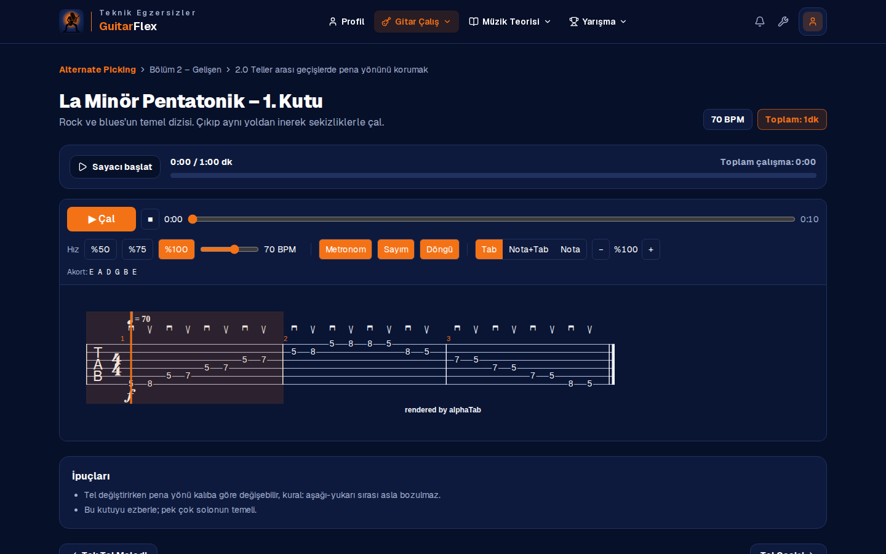
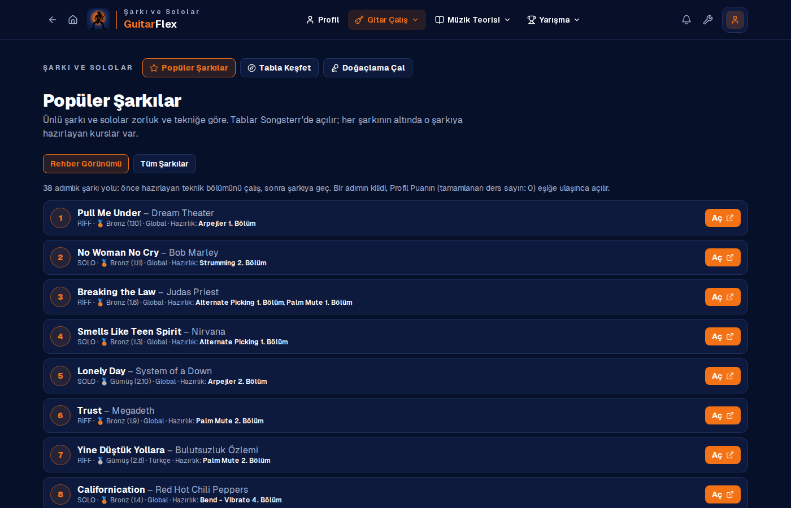
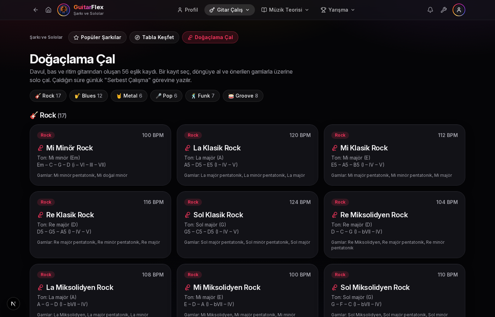
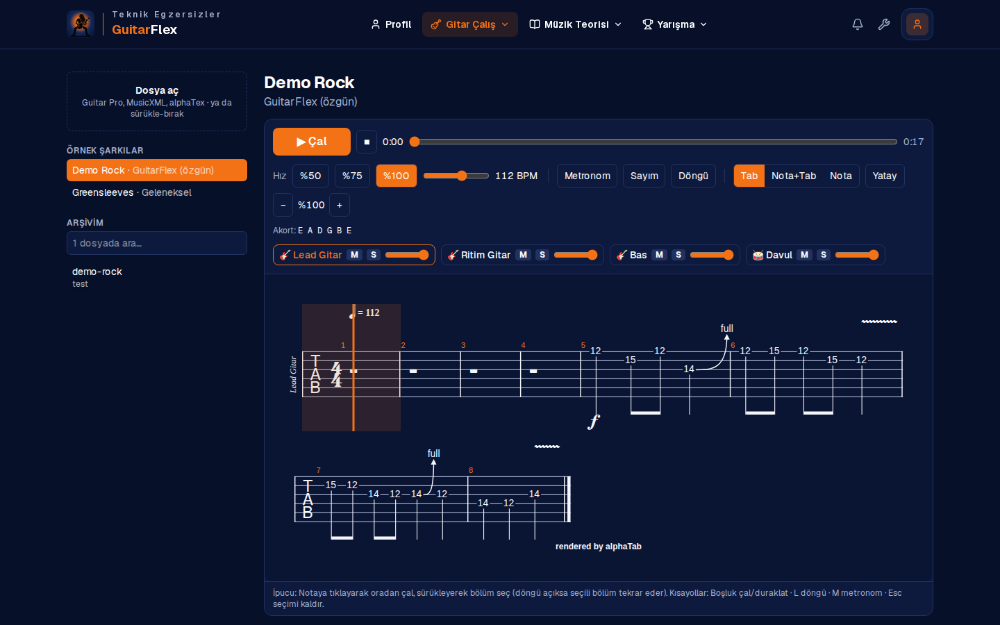
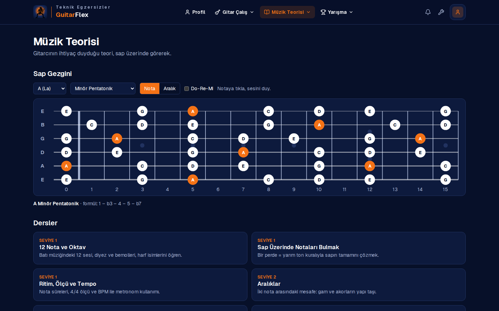

# GuitarFlex — Gitar Akademisi

**GuitarFlex** is a guitar academy I designed and built: a desktop app (Electron) and a website (Next.js) running from a single codebase.
It takes a player from the first chord to neoclassical sweep arpeggios through 12 structured technique courses, explains the music theory
behind every exercise, and adds a songs & solos library, backing tracks for improvisation and a Songsterr-style multi-track tab player.

| Ana sayfa | Menü |
|---|---|
|  |  |
| **Kurs** | **Ders** |
|  |  |
| **Popüler Şarkılar** | **Doğaçlama Çal** |
|  |  |
| **Tab oynatıcı** | **Müzik teorisi** |
|  |  |

## Highlights

- **12 complete technique courses, 557 original exercises** — Alternate Picking, Legato, Sweep Picking, Tapping, Economy Picking, Bend & Vibrato, Slide, Palm Mute, Arpeggios, Chords, Rhythm & Strumming and Chromatic Warm-ups, each split into 3–6 sections that progress from easy to hard
- **Music theory on every lesson** — scale formulas, intervals, chord construction, progressions and rhythm explained next to the tab
- **Generated, verified tabs** — scale fingerings, arpeggio shapes, sequences, legato slurs and pick-stroke directions (alternate, sweep, economy) are computed from pitch data; an automated checker validates every bar's length and every hammer-on, pull-off and slide
- **Multi-track tab player** — Guitar Pro / MusicXML / alphaTex playback with per-track mute, solo and volume, speed control, metronome, count-in, click-to-seek and drag-to-loop
- **Songs & solos** — a curated library of famous songs and solos filtered by difficulty and technique, linked to Songsterr and to the courses that prepare for them
- **Improvisation** — backing tracks (drums, bass, rhythm guitar) in seven styles, each with suggested scales shown on an interactive fretboard
- **Practice tracking** — automatic practice timer per lesson, streaks, ranks, badges and course progress
- **Desktop app with one-click updates** — the launcher pulls new versions, rebuilds when needed and opens the app
- **Brand identity** — name, navy/orange palette and guitarist-silhouette logo drawn programmatically as SVG

**Tech stack:** Next.js 16 (App Router) · React 19 · TypeScript · Tailwind CSS 4 · alphaTab (tab rendering & MIDI playback) · Electron · Web Audio API

---

## Türkçe

Kolaydan zora gitar teknikleri, her derste müzik teorisi, şarkı kütüphanesi, doğaçlama eşlikleri ve çalışma takibi sunan bir gitar akademisi.
Masaüstü uygulaması ve web sitesi aynı koddan çalışır.

### Özellikler

- **12 teknik kursu, 557 özgün ders**: Bölüm → alt bölüm (1.0, 1.1 …) → ders yapısı. Her dersin tabı, BPM'i ve hedef süresi var; süre dolunca ders tamamlanır.
- **Müzik Bilgisi**: Her derste gam, aralık, akor ve ritim açıklaması; tab ile aynı veriden üretildiği için nota adları her zaman tabla uyuşur.
- **Başlangıç rehberleri**: Sıfırdan başlayanlar ve başlangıç–orta seviye için kurslardan seçilmiş çalışma yolları; tablı derslerin arasında okuma adımları.
- **Elektro ve akustik**: Teknik kursları elektro ve akustik gitar için ayrı gruplarda.
- **Şarkı ve Sololar**: Popüler Şarkılar (zorluk ve tekniğe göre, Songsterr bağlantılı), Tabla Keşfet (çok kanallı tab oynatıcı) ve Doğaçlama Çal (7 eşlik kaydı ve önerilen gamlar).
- **Tab oynatıcı**: Guitar Pro, MusicXML ve alphaTex; enstrüman bazında ses/mute/solo, hız, metronom, sayım, döngü, nota görünümü.
- **Müzik teorisi**: 10 ders ve interaktif sap gezgini (gamlar, akorlar, aralıklar, Do-Re-Mi).
- **Profil**: Otomatik çalışma süresi, seri, rütbe, rozetler ve kurs ilerlemesi.
- **Araçlar**: Metronom ve nota bulma testi.

### Son güncellemeler

- **Akustik gitar** kursları için ayrı menü sütunu ve ana sayfa bölümü
- Rehberlerde tabsız **okuma adımları** ("Nasıl çalınır?" anlatımları) ve kurs sırasının içerikle birlikte belirlenmesi
- **Şarkı ve Sololar** bölümü: Popüler Şarkılar, Tabla Keşfet ve Doğaçlama Çal
- **12 teknik kursunun tamamı** yeniden yazıldı: 3–6 bölüm, toplam 557 ders; her derste "Müzik Bilgisi" kutusu
- Gam, arpej, sweep, legato ve economy picking parmak düzenleri ile pena yönleri nota verisinden otomatik hesaplanıyor
- Üst menü sütunlu açılır panellere dönüştü
- Başlangıç rehberleri yeni kurslardan seçilmiş derslerle yeniden kuruldu

### Yol haritası

- **Ton Lab**: ünlü şarkıların gitar tonlarını kişinin kendi ekipmanına (amfi modelleyici, pedal) uyarlama
- Üyelik ve buluta kayıtlı ilerleme
- Haftalık meydan okumalar ve sıralama
