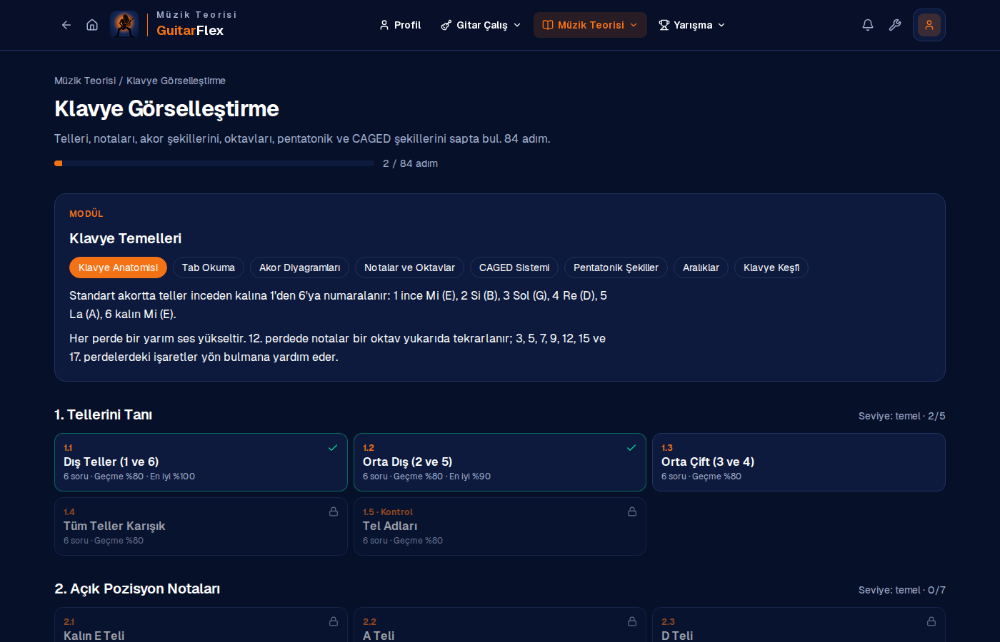
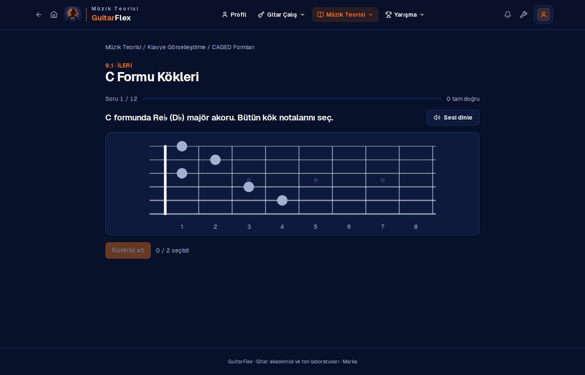
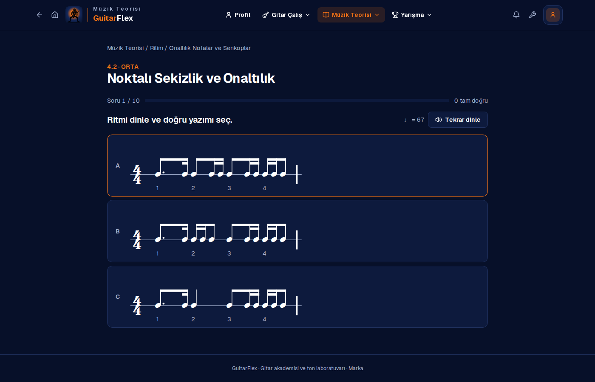
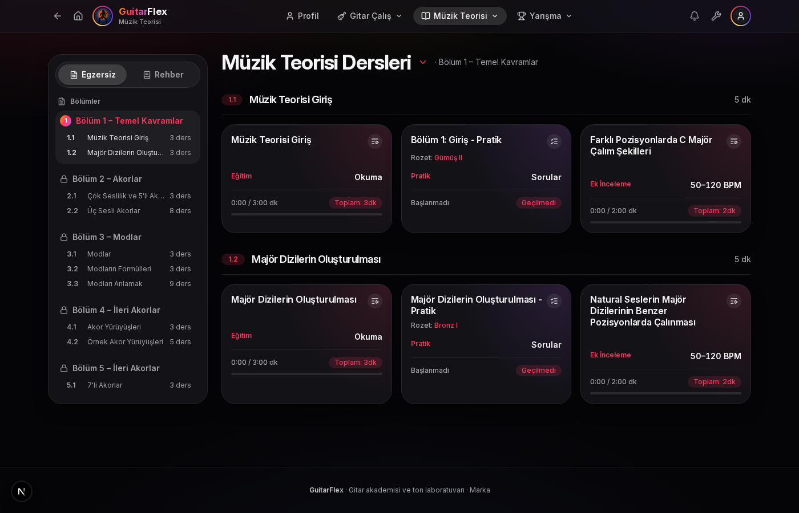
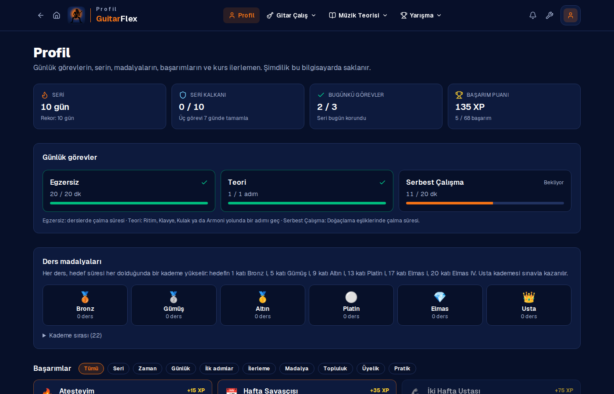

# GuitarFlex — Gitar Akademisi

**GuitarFlex** is a guitar academy I designed and built: a desktop app (Electron) and a website (Next.js) running from a single codebase.
It takes a player from the first chord to neoclassical sweep arpeggios through 12 structured technique courses, explains the music theory
behind every exercise, and adds a songs & solos library, backing tracks for improvisation and a Songsterr-style multi-track tab player.

| Ana sayfa | Menü |
|---|---|
|  |  |
| **Kurs** | **Ders** |
|  |  |
| **Popüler Şarkılar** | **Doğaçlama Çal** |
|  |  |
| **Tab oynatıcı** | **Müzik teorisi** |
|  |  |
| **Klavye Görselleştirme yolu** | **Sapta soru (CAGED)** |
|  |  |
| **Ritim: dinle, seç, vur** | **Armoni dersleri** |
|  |  |
| **Profil: görevler, seri, başarımlar** | |
|  | |

## Highlights

- **12 complete technique courses, 557 original exercises** — Alternate Picking, Legato, Sweep Picking, Tapping, Economy Picking, Bend & Vibrato, Slide, Palm Mute, Arpeggios, Chords, Rhythm & Strumming and Chromatic Warm-ups, each split into 3–6 sections that progress from easy to hard
- **Music theory on every lesson** — scale formulas, intervals, chord construction, progressions and rhythm explained next to the tab
- **Generated, verified tabs** — scale fingerings, arpeggio shapes, sequences, legato slurs and pick-stroke directions (alternate, sweep, economy) are computed from pitch data; an automated checker validates every bar's length and every hammer-on, pull-off and slide
- **Multi-track tab player** — Guitar Pro / MusicXML / alphaTex playback with per-track mute, solo and volume, speed control, metronome, count-in, click-to-seek and drag-to-loop
- **Theory practice paths** — Rhythm (70 steps), Fretboard Visualization (84) and Ear Training (60): questions are generated fresh on every attempt — notes, octaves, pentatonic, CAGED and 3NPS shapes on a clickable fretboard, chord diagrams, interval/chord/scale/progression recognition with synthesized guitar sound, and rhythm reading with tap-back scoring rendered in SMuFL notation
- **Harmony course** — 5 sections, 10 chapters with reading cards, generated practice quizzes (correctly spelled scales, triads, modes, diatonic and seventh chords) and playable example tabs
- **Songs & solos** — a song guide (38 ordered steps tied to course sections) and a library of 99 songs with medal levels, origin/type filters and sorting, linked to Songsterr
- **Improvisation** — 56 backing tracks (drums, bass, rhythm guitar) in six genres, chords spelled from scale degrees, each with compatible scales on an interactive fretboard
- **Game layer** — daily tasks, task-based streaks with streak shields, per-lesson medal tiers, 68 achievements with rarity and XP
- **Desktop app with one-click updates** — the launcher pulls new versions, rebuilds when needed and opens the app
- **Brand identity** — name, navy/orange palette and guitarist-silhouette logo drawn programmatically as SVG

**Tech stack:** Next.js 16 (App Router) · React 19 · TypeScript · Tailwind CSS 4 · alphaTab (tab rendering & MIDI playback) · Electron · Web Audio API

---

## Türkçe

Kolaydan zora gitar teknikleri, her derste müzik teorisi, şarkı kütüphanesi, doğaçlama eşlikleri ve çalışma takibi sunan bir gitar akademisi.
Masaüstü uygulaması ve web sitesi aynı koddan çalışır.

### Özellikler

- **12 teknik kursu, 557 özgün ders**: Bölüm → alt bölüm (1.0, 1.1 …) → ders yapısı. Her dersin tabı, BPM'i ve hedef süresi var; süre dolunca ders tamamlanır.
- **Müzik Bilgisi**: Her derste gam, aralık, akor ve ritim açıklaması; tab ile aynı veriden üretildiği için nota adları her zaman tabla uyuşur.
- **Başlangıç rehberleri**: Sıfırdan başlayanlar ve başlangıç–orta seviye için kurslardan seçilmiş çalışma yolları; tablı derslerin arasında okuma adımları.
- **Elektro ve akustik**: Teknik kursları ve şarkılar elektro ve akustik gitar için ayrı sayfalarda; seviyeye göre çalışma yolu seçici.
- **Şarkı ve Sololar**: Şarkı Rehberi (teknik bölümlerine bağlı 38 adım), Tüm Şarkılar (madalya seviyesi, köken, tür, arama ve sıralama), Tabla Keşfet (çok kanallı tab oynatıcı) ve Doğaçlama Çal (6 türde 56 eşlik kaydı ve önerilen gamlar).
- **Tab oynatıcı**: Guitar Pro, MusicXML ve alphaTex; enstrüman bazında ses/mute/solo, hız, metronom, sayım, döngü, nota görünümü.
- **Müzik teorisi**: Ritim (70 adım), Klavye Görselleştirme (84 adım) ve Kulak Eğitimi (60 adım) pratik yolları; sorular her denemede yeniden üretilir. Armoni (Müzik Teorisi Dersleri): 5 bölüm, Eğitim / Pratik / Ek İnceleme kartları. Ayrıca 10 ders ve interaktif sap gezgini.
- **Profil**: Günlük görevler (Egzersiz, Teori, Serbest Çalışma), seri ve seri kalkanı, ders madalyaları (Bronz I → Elmas IV), 68 başarım ve XP, kurs ilerlemesi.
- **Araçlar**: Metronom ve nota bulma testi.

### Son güncellemeler

- **Renk paleti**: lacivert zemin, beyaz yazı (ikincil yazılar da beyaza yakın), sayfa başlıkları turuncu; teori ve profil ekranlarındaki ek renkler bu palete indirildi
- **Teori yolları**: Ritim (dinle, yazımı seç, geri vur), Klavye Görselleştirme (sapta tel, nota, oktav, pentatonik, CAGED, 3NPS) ve Kulak Eğitimi (aralık, akor türü, gam, akor yürüyüşü); adımlar sırayla açılır, sonuçlar kaydedilir
- **Armoni**: 5 bölüm, 10 alt bölüm; Eğitim metinleri, her denemede yeni sorularla Pratik kartları (notalar harf adına göre doğru yazılır) ve çalınacak Ek İnceleme tabları
- **Şarkı Rehberi** (38 adım) ve **Tüm Şarkılar** filtreleri: Bronz–Usta seviyeleri, Global/Türkçe, Riff/Solo, arama ve sıralama
- **Doğaçlama Çal**: Rock, Blues, Metal, Pop, Funk ve Groove türlerinde 56 eşlik; akorlar tonun derecelerinden yazılır, akor şekilleri ve gamlar otomatik denetlenir
- **Profil**: günlük görevler, seri ve seri kalkanı, ders madalya kademeleri ve 68 başarım
- Kurs ve rehber derslerinde envanterle eşleşen adlar, bölüm sınavı satırları, ders hedefleri ve süreleri; tabların müzik ve gitar teorisi denetimi genişletildi
- Çalmadan önceki **sayım** ekranda geri sayan rakamla görünüyor; **İptal**, **Hemen başla** ve **Sayımı kapat** düğmeleri var (Esc de iptal eder), sayım tercihi hatırlanıyor
- Üst menü sadeleşti: **Gitar Çalış** altında Akustik (Teknik Egzersizler, Şarkılar) ve Elektro (Teknik Egzersizler, Şarkı ve Sololar) başlıkları; egzersizler bu sayfalarda
- **Geri** ve **Ana sayfa** tuşları; logonun yanındaki başlık bulunulan bölümü gösterir
- **Gitarda Nasıl Çalışmalıyım?**: elektro ve akustik için seviyeye göre çalışma yolu seçici
- Akustik gitar için ayrı egzersiz ve şarkı sayfaları
- Şarkı listesinde her şarkının altında hazırlık kurslarının adları ve kurs filtresi
- Rehberlerde tabsız **okuma adımları** ("Nasıl çalınır?" anlatımları) ve kurs sırasının içerikle birlikte belirlenmesi
- **Şarkı ve Sololar** bölümü: Popüler Şarkılar, Tabla Keşfet ve Doğaçlama Çal
- **12 teknik kursunun tamamı** yeniden yazıldı: 3–6 bölüm, toplam 557 ders; her derste "Müzik Bilgisi" kutusu
- Gam, arpej, sweep, legato ve economy picking parmak düzenleri ile pena yönleri nota verisinden otomatik hesaplanıyor
- Başlangıç rehberleri yeni kurslardan seçilmiş derslerle yeniden kuruldu

### Yol haritası

- **Ton Lab**: ünlü şarkıların gitar tonlarını kişinin kendi ekipmanına (amfi modelleyici, pedal) uyarlama
- Üyelik ve buluta kayıtlı ilerleme
- Haftalık meydan okumalar ve sıralama
