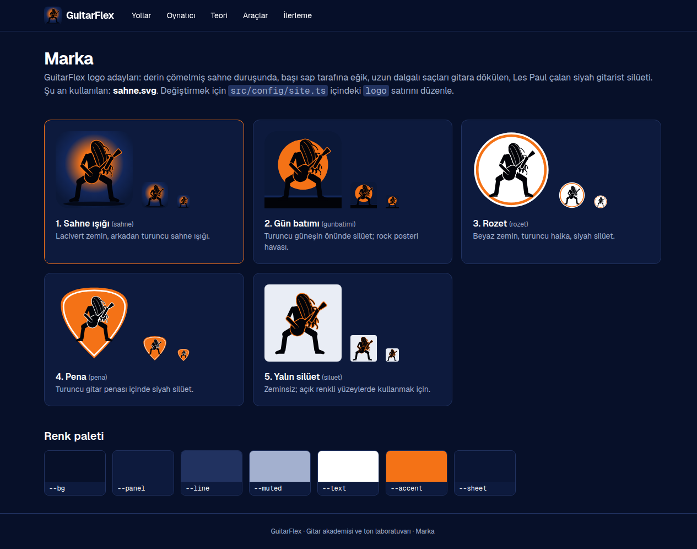

# GuitarFlex — Gitar Akademisi

**GuitarFlex** is a guitar practice platform that runs both as a desktop app (Electron) and as a website (Next.js) from a single codebase.
It offers structured technique pathways with an interactive tab player, music theory lessons with an interactive fretboard,
practice tracking (streaks, ranks, badges) and a Songsterr-style multi-track Guitar Pro player.

| Ana sayfa | Kurs |
|---|---|
|  |  |
| **Ders** | **Tab oynatıcı** |
|  |  |
| **Müzik teorisi** | **Marka** |
|  |  |

**Tech stack:** Next.js 16 (App Router) · React 19 · TypeScript · Tailwind CSS 4 · alphaTab (tab rendering & MIDI playback) ·
Electron (desktop app with self-updating launcher) · Web Audio API (metronome, note playback)

**Highlights**
- Multi-track Guitar Pro / MusicXML / alphaTex player: per-track mute/solo/volume, speed control, metronome, count-in, click-to-seek, drag-to-loop
- Course structure (course → section → chapter → lesson) with timed lessons, locked sections and per-lesson progress
- Pluggable private content packs (JSON + images + Guitar Pro files) loaded at runtime from a git-ignored folder
- 65 original exercises written as alphaTex and validated by a custom checker (`npm run check-content`) that verifies every bar's length
- Interactive SVG fretboard: scales, chords, intervals, note playback and a timed note-finding quiz
- Desktop launcher that pulls updates from GitHub, rebuilds when needed and starts the app with one click
- Brand assets (logo silhouettes) generated programmatically as SVG (`scripts/logo-ciz.py`)

---

Kolaydan zora gitar teknikleri, müzik teorisi ve çalışma takibi sunan masaüstü uygulaması ve web sitesi. İleride **Ton Lab** (ünlü şarkıların tonlarını kişinin kendi ekipmanına uyarlama) modülü eklenecek.

## Özellikler

- **Kurslar** (`/calis/<kurs>`): Bölüm → alt bölüm (1.0, 1.1 …) → ders yapısı. Her dersin BPM'i ve hedef süresi var; süre dolunca ders tamamlanır.
  Sol panelde Egzersiz/Rehber sekmeleri, eğitim videoları, bölümler ve sınav satırları. 12 teknik kursu ve 2 başlangıç rehberi yerleşik gelir.
- **İçerik paketi**: `ozel-kaynak/icerik/*.json` ile kendi kurslarını, görsellerini ve tablarını ekleyebilirsin (bkz. [docs/ICERIK-PAKETI.md](docs/ICERIK-PAKETI.md)).
- **Tab oynatıcı** (`/oynatici`): Guitar Pro (.gp, .gp3–.gp7, .gpx), MusicXML ve alphaTex dosyalarını açar. Özellikler:
  - çoklu enstrüman: track seçimi, mute, solo, ses seviyesi
  - hız (%25–150), metronom, sayım, döngü
  - notaya tıklayıp oradan çalma, sürükleyerek bölüm seçip döngüye alma
  - Tab, Nota+Tab ya da Nota görünümü; yatay mod; zoom
  - kısayollar: Boşluk çal/duraklat, L döngü, M metronom, Esc seçimi kaldır
- **Kişisel arşiv**: `ozel-kaynak/tablar/` klasörüne koyduğun tab dosyaları oynatıcıda "Arşivim" altında listelenir. Bu klasör Git'e gönderilmez.
- **Profil** (`/profil`): Çalma süresi otomatik sayılır. Seri (streak), rütbe, rozetler, kurs ilerlemesi, son çalışmalar.
- **Müzik teorisi** (`/teori`): 10 ders ve interaktif sap gezgini (gamlar, akorlar, aralıklar, Do-Re-Mi).
- **Araçlar** (`/araclar`): Metronom ve 60 saniyelik nota bulma testi.

İlerleme şimdilik tarayıcıda (localStorage) saklanıyor. Üyelik sistemi eklenince Supabase'e taşınacak.

## Çalıştırma

Adım adım Windows rehberi: [KURULUM.md](KURULUM.md)

```bash
npm install            # alphaTab dosyalarını public/alphatab altına da kopyalar
npm run desktop        # masaüstü uygulaması (Electron), geliştirme modu
npm run desktop:prod   # masaüstü uygulaması, derlenmiş hızlı mod
npm run kisayol        # Windows: masaüstüne kendini güncelleyen GuitarFlex kısayolu ekler
npm run dev            # web sitesi: http://localhost:3000
```

Masaüstü uygulaması ile web sitesi aynı kodu kullanır; arayüzde yapılan her değişiklik ikisine birden yansır.
Uygulama adı ve logo `src/config/site.ts`, renk paleti (lacivert, turuncu, beyaz) `src/app/globals.css` içinde.
Logo adayları `public/marka/` klasöründe; uygulamada **Marka** sayfasında (alt bilgideki bağlantı) görülebilir.
Logoları yeniden üretmek için: `python3 scripts/logo-ciz.py`.

Diğer komutlar:

```bash
npm run build          # production build
npm run lint
npm run check-content  # tüm tabları alphaTab ile ayrıştırır, her ölçünün 4/4 olduğunu doğrular
```

## Yapı

```
desktop/main.cjs            masaüstü uygulaması (Electron penceresi + menüler)
desktop/guncelle.cjs        kısayoldan açılışta GitHub'dan güncelleme + derleme
desktop/kisayol-olustur.cjs masaüstü / Başlat menüsü kısayolu (Windows)
src/config/site.ts          uygulama adı ve metinleri
src/content/courses.ts      yerleşik kurslar ve başlangıç rehberleri
src/lib/courses.ts          kurs yükleyici (yerleşik + ozel-kaynak/icerik paketi)
src/content/techniques.ts   egzersizler (alphaTex formatında tablar)
src/content/tex.ts          tab yazım yardımcıları
src/content/theory.ts       teori dersleri
src/content/songs.ts        oynatıcıyla gelen örnek şarkılar
src/lib/archive.ts          kişisel arşiv (ozel-kaynak/tablar) okuma
src/lib/progress.ts         ilerleme kaydı
src/lib/ranks.ts            rütbe ve rozetler
src/lib/music.ts            nota, gam ve akor hesapları
src/components/             TabPlayer, Fretboard, Metronome, NoteQuiz…
```

### Yeni egzersiz eklemek

`src/content/techniques.ts` içinde ilgili tekniğin `level(...)` listesine bir nesne ekle. Tab yazımı `perde.tel` şeklindedir (tel 1 = ince Mi, tel 6 = kalın Mi). Örnek: `:8 5.6 7.6 5.5{h} 7.5`. Sözdizimi için [alphaTex dokümantasyonuna](https://alphatab.net/docs/alphatex/introduction) bak. Ekledikten sonra `npm run check-content` çalıştır.
